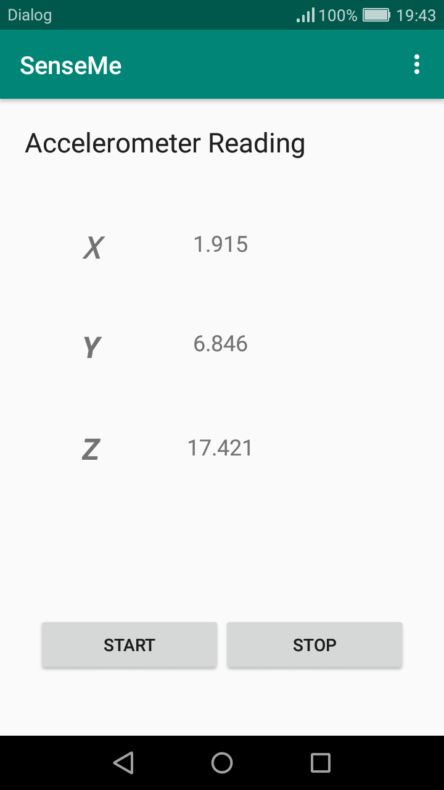

# SenseMe
Simple Android application which reads sensor readings of the device via standard APIs provided.

Supports Android 6.0 "Marshmallow" and above

Takes accelerometer reading of the device, then threshould the reading and display in a TextView.
Have two buttons to Start and Stop the reading.

<h3 align="center"> Sample Screen <h3>

  
  

